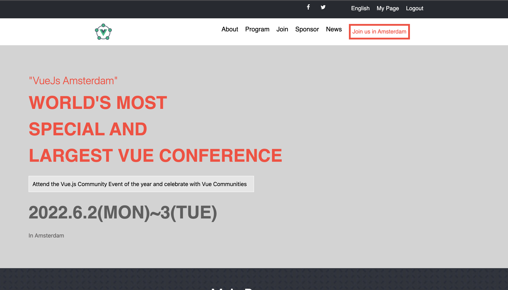

# VueJs | AMSTERDAM

> made by Ntare Guy

## Visit the page [here](https://41hulk.github.io/vuejs-amsterdam/)

## Built With

- HTML & CSS & JAVASCRIPT
- GIT, GITHUB, LINTERS, NPM, LITHOUSE, WEBHINT, STYLELINT

## Author

👤 **NTARE GUY**

- GitHub: [@githubhandle](https://github.com/41hulk)
- Twitter: [@twitterhandle](https://twitter.com/ntare_guy)
- LinkedIn: [LinkedIn](https://linkedin.com/in/ntare-guy)

## 🤝 Contributing

Contributions, issues, and feature requests are welcome!

Feel free to check the [issues page](../../issues/).

## Acknowledge

- Original design by **Cindy Shin**: [LinkedIn](https://www.linkedin.com/in/adagio07/), [Behance](https://www.behance.net/adagio07)

## Show your support

Give a ⭐️ if you like this project!

## 📝 License

This project is [MIT](./MIT.md) licensed.
